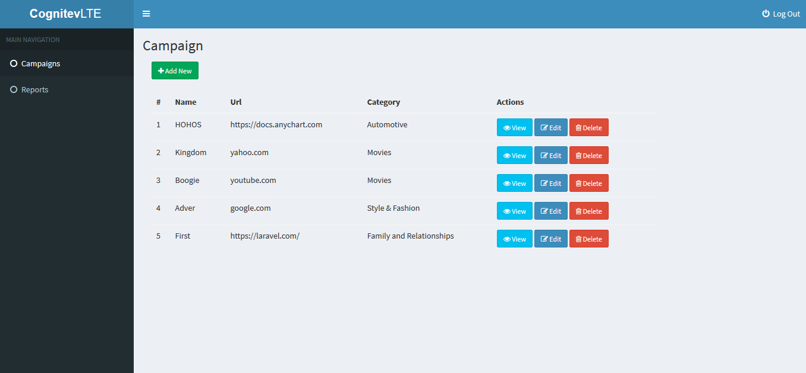
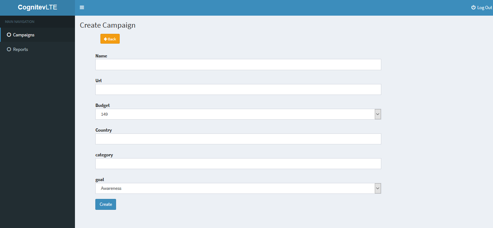
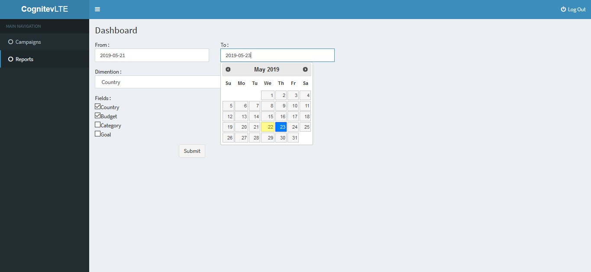
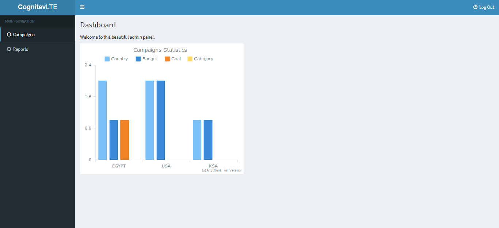

# RESTful App

This app uses extraction service  that allows him to extract data from URL to start a campaign over it !


# Setup

After getting this project please follow these steps :
- create a database in Mysql
- open .env file and change the DB paramitars
```
> DB_DATABASE={{ your database name }}
> DB_USERNAME={{ your mysql username }}
> DB_PASSWORD={{ your mysql password}}
```
Then save it.
 - run the command "composer install" and "php artisan key:generate"
 - run the command "php artisan migrate"
 - run the command "php artisan serve" then you will get a link like this (http://127.0.0.1:8000) open it !
 - register to the web app then login

## Usage

After you open the app you will find a navigation area on the left, use it to create new campaign

- List campaigns

- Create a campaign

- Generate report

- Viewed report


